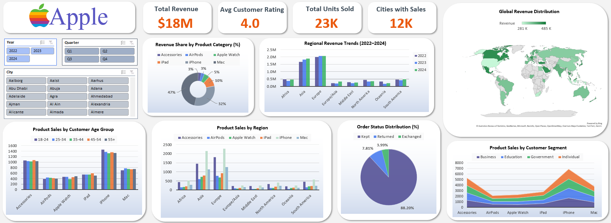

# Apple Global Sales Dashboard

## Overview

This project presents an interactive sales dashboard built in Microsoft Excel to analyze Apple product performance across regions, customer segments, and product categories. The dashboard transforms raw sales data into meaningful insights using dynamic pivot tables, slicers, and visualizations.

The objective of this project is to demonstrate how Excel can be used as a powerful business intelligence tool to explore sales trends, identify high-performing products, and understand customer purchasing behavior across different markets.

## Dashboard Preview



## Key Metrics

The dashboard summarizes core business indicators to provide a quick understanding of overall performance.

| Metric                         | Value    |
| ------------------------------ | -------- |
| **Total Revenue Generated**    | **$18M** |
| **Average Customer Rating**    | **4.0**  |
| **Total Units Sold**           | **23K**  |
| **Cities with Recorded Sales** | **12K**  |

These metrics provide a high-level view of the scale of operations, customer satisfaction, and product demand.

## Business Questions Answered

The dashboard helps answer several key analytical questions:

* Which Apple product categories generate the highest revenue?
* How does revenue vary across global regions?
* Which customer age groups purchase the most products?
* How do different customer segments contribute to sales?
* What proportion of orders are kept, returned, or exchanged?
* How does product demand vary across geographic markets?

## Key Insights

Analysis of the dataset reveals several notable patterns:

* **iPhone contributes the largest share of total revenue**, making it the primary revenue driver among Apple products.
* **Europe and Asia generate the highest regional revenue**, indicating strong market demand in these regions.
* The **25–34 age group purchases the highest number of products**, suggesting strong engagement from young professionals.
* A large majority of orders are **kept by customers**, while returns and exchanges represent a relatively small portion of total transactions.

## Dashboard Features

The dashboard includes several interactive components designed to enhance data exploration:

* Dynamic filtering using **Year, Quarter, and City slicers**
* **Category-level revenue distribution** visualized using percentage share
* **Regional revenue trends from 2022 to 2024**
* **Global revenue mapping** to highlight geographic performance
* **Customer age group analysis** to understand purchasing patterns
* **Customer segment comparison** to evaluate sales across different user groups
* **Order status distribution** showing kept, returned, and exchanged items

## Tools and Techniques

This project was developed using the following tools and techniques:

* Microsoft Excel
* Pivot Tables
* Pivot Charts
* Map Charts
* Slicers for interactive filtering
* Data aggregation and visualization techniques

## Project Structure

```
apple-sales-dashboard
│
├── apple_sales_dashboard.xlsx
├── dashboard-overview-apple.png
└── README.md
```
## How to Use the Dashboard

1. Download the Excel file from this repository.
2. Open **apple_sales_dashboard.xlsx** in Microsoft Excel.
3. Use the slicers on the left side of the dashboard to filter data by:

   * Year
   * Quarter
   * City
4. All charts and KPI metrics will update automatically based on the selected filters.

## Author

Kirti Sharma
